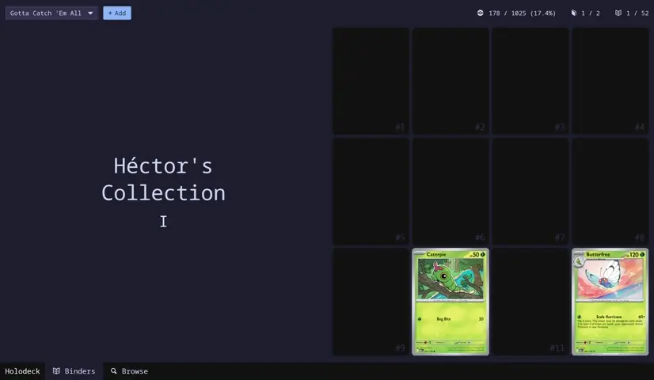
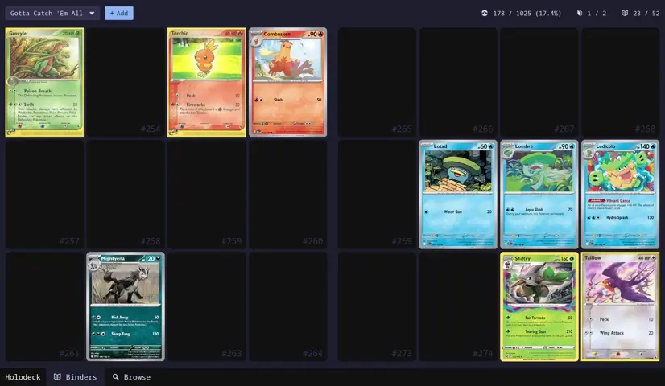

<div align="center">

# Holodeck

[](https://crates.io/crates/holodeck)
[](https://github.com/hecrj/holodeck/blob/master/LICENSE)
[](https://crates.io/crates/holodeck)
[](https://github.com/hecrj/holodeck/actions)
[](https://github.com/iced-rs/iced)

An application to track, manage, and visualize your TCG collection — Pokémon only for now!




</div>

## Features

- Extensive embedded database (~29,000 cards)
- Binder view for easy IRL collection
- Price tracking
- Multiple profiles
- Minimum remote API usage for maximum speed
- Cool animations!
- Powered by [PokemonTCG] and [TCGdex]
- Very experimental, very work in progress!
- ... more to come!

[PokemonTCG]: https://pokemontcg.io
[TCGdex]: https://tcgdex.dev


## Installation

No pre-built binaries yet! Use `cargo` to try it out:

```bash
cargo install --git https://github.com/hecrj/holodeck.git
```

If you want the highest quality images, it is also recommended that you get an API key
from [PokemonTCG] and place it inside an env variable named `POKEMONTCG_API_KEY`.


## Disclaimer

This application is not affiliated with, endorsed, sponsored, or approved by Nintendo, Game Freak, The Pokémon Company, or any other official TCG publisher.

All trademarks and copyrighted materials are the property of their respective owners.
